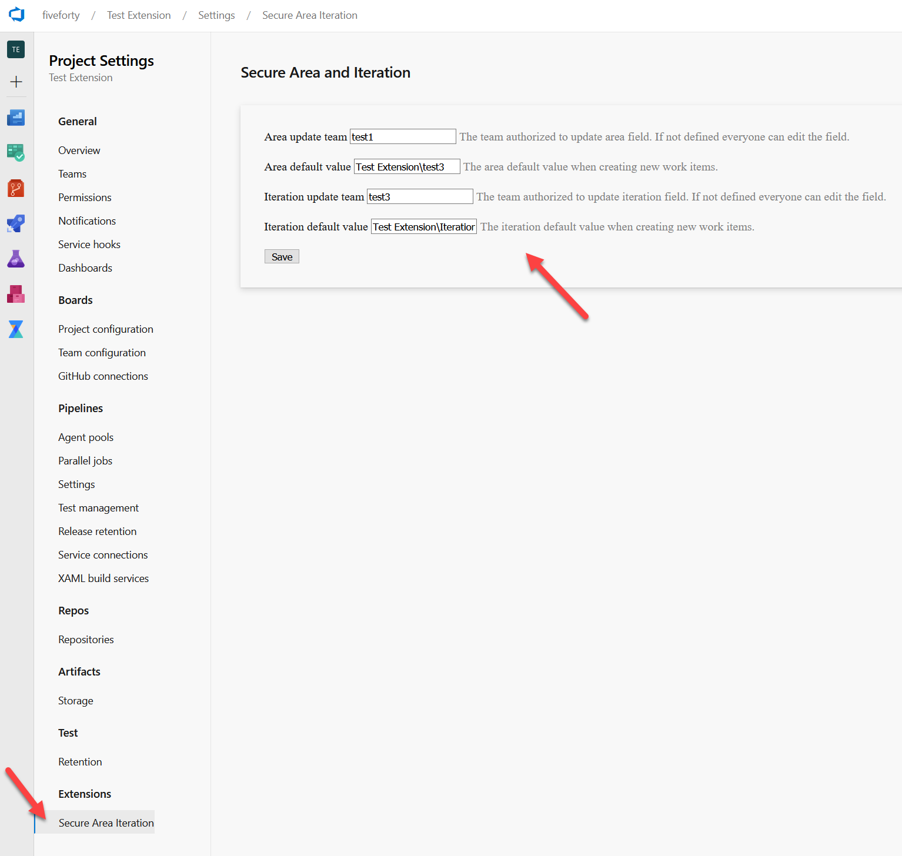

# Secure area and iteration fields extension

Use this extension to enable or disable editing the work item Area and Iteration fields.

## Configuration

You can configure this extension in the project settings page.

To restrict the area or iteration field changes to a team, fill the settings form with the team names.

In the screen capture below, we can see that for the "Test extension" project, we have authorized test1 team members to make changes on the area field. And only test3 team members can make iteration changes on work items.

If a team is not set for a field, all users can make updates for this project.

If a default value is defined for area or iteration fields, these values will be used to initialize new work items. If not defined, the user can set any value when creating a new work item.

